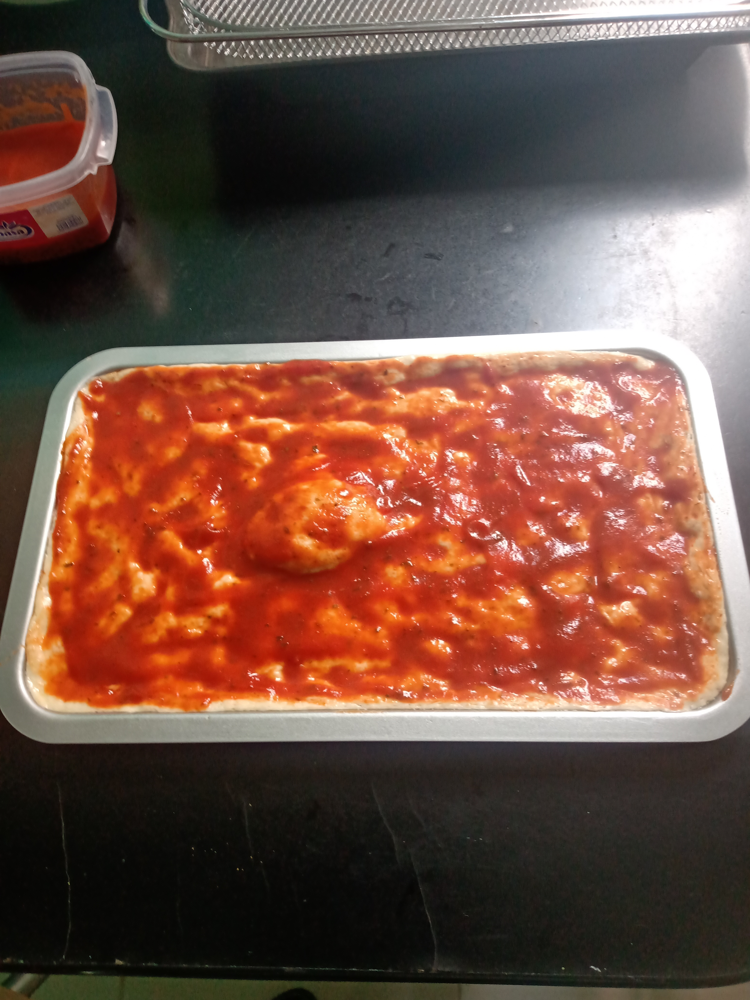

https://www.youtube.com/watch?v=j5MmB35tEog

# Cantidades (original):

*** PARA LAS MASA:
- 500g Harina tipo 00
- 350ml de agua
- 10g de levadura (una cucharada)
- 20g de sal
- Un poco de aceite de oliva

*** PARA LA SALSA DE TOMATE:
- 250g de salsa de tomate 
- 1 cdta de Orégano 
- 1 cda Aceite de Oliva

*** TOPPINGS:
- Peperoni (Salami Picante)
- Jamón en rebanadas delgadas.
- 250g de Queso Mozzarella 

# Cantidades:

- 150 g Harina
- 105 mL Agua
- 3 g Levadura
- 5 g Sal
- Aceite de oliva

# Receta:

- Mezclar la harina con la levadura
- Incorporar la mitad del agua
- Incoporar la sal
- Incorporar el resto de harina y agua
- Un chorrito de aceite a la masa
- Amazar en un trozo de madera
- Si se pega mucho usar un poco más de harina en las manos
- Dejar reposar 2 horas debajo de un trapo humedo o plastico
*** 
- En una charola hechar aceite de oliva
- Expandir la masa en la charola
- Dejar reposar 1 hora mas
***
- Hechar salsa de tomate con oregano y un poco de sal
- Hornear a temperatura máxima por 3-5 min en horno de gas
```shell
- Con horno electrico
Hornear por 5 minutos
```
- Agregar queso y toppings
- Hornear de nuevo a temp maxima por 3-5 min en horno de gas
```shell
- Con horno electrico
Hornear por 10-15 minutos
```





