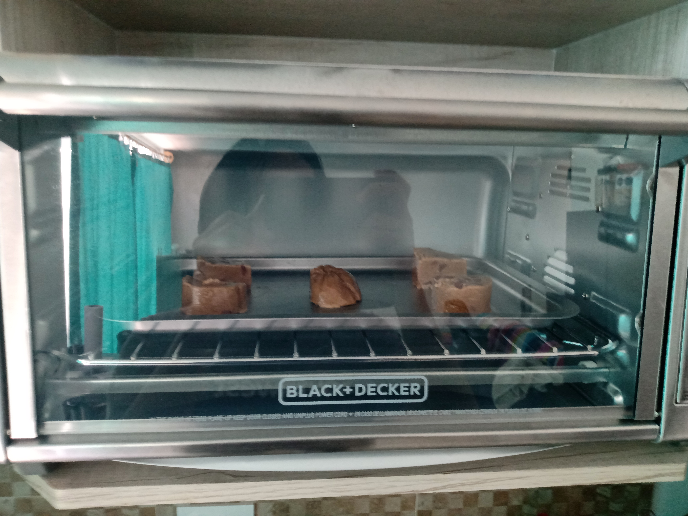
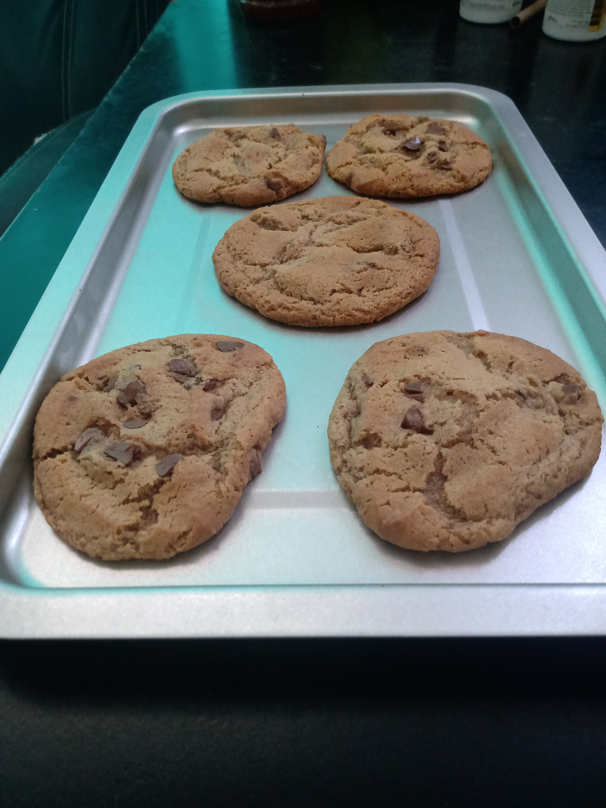

https://www.youtube.com/watch?v=va_mgjOWW9k

# Cantidades:

- 2 1/2 tazas (350g) Harina de Trigo
- 1 taza (225g) Mantequilla sin Sal 
- 1 taza (210g) Azúcar morena compactada 
- 1/2 taza (100g) Azúcar blanca
- 2 Huevos
- 2 cdas Vainilla
- 1/2 cdta Sal
- 1 cdta Bicarbonato de Sodio
- 2 tazas (350g) Chocolate Chips (chispas)

# Receta:

- Mezclar mantequilla, azucar blanca y morena
- Batir hasta cremosa
- Agregar un huevo a la vez
- Agregar vainilla
- En otro recipiente mezclar la harina, sal, bicarbonato de sodio
- Mezclar todo en 3 partes
- Hechar chispas de chocolate
- Envolver en plastico y hechar al conguelador por 2-3 horas
- 10-12min en el horno a 350°F / 176.666°C, o sacar antes una vez que las orillas esten doradas

