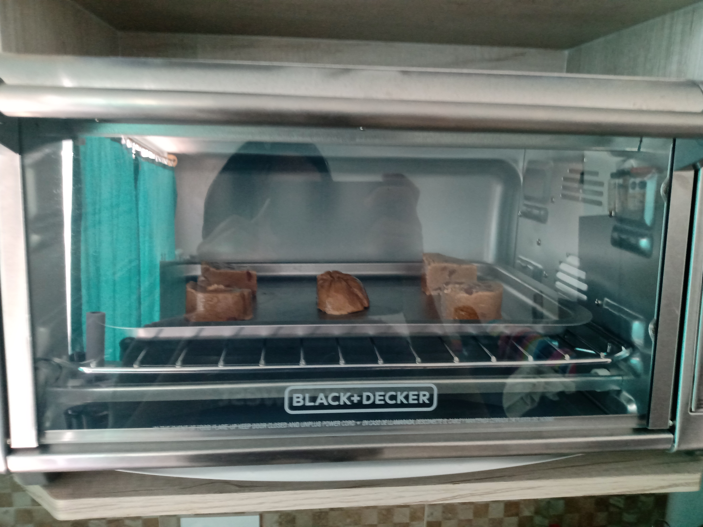

https://www.youtube.com/watch?v=va_mgjOWW9k
https://www.youtube.com/watch?v=i-4v5_UvmsE

# Cantidades:

- 2 1/2 tazas (350g) Harina de Trigo [360g]
- 1 taza (225g) Mantequilla sin Sal
- 1 taza (210g) Azúcar morena compactada [150g]
- 1/2 taza (100g) Azúcar blanca [150g]
- 2 Huevos
- 2 cdas Vainilla [1]
- 1/2 cdta Sal
- 1 cdta Bicarbonato de Sodio [1/2]
- 2 tazas (350g) Chocolate Chips (chispas) [340g] (son muchas, usar la mitad)

# Cantidades (1 barra de mantequilla):

- 140g Harina de Trigo [144g]
- 90g Mantequilla sin Sal 
- 84g Azúcar morena compactada [60g]
- 40 Azúcar blanca [60g]
- 1 Huevos
- 1 cdas Vainilla [1/2]
- 1/4 cdta Sal
- 1/2 cdta Bicarbonato de Sodio [1/4]
- 140g Chocolate Chips (chispas) [136g]

# Receta:

- Mezclar mantequilla, azucar blanca y morena
- Batir hasta cremosa
- Agregar un huevo a la vez
- Agregar vainilla
- En otro recipiente mezclar la harina, sal, bicarbonato de sodio
- Mezclar todo en 3 partes
- Hechar chispas de chocolate
- Envolver en plastico y hechar al conguelador por 2-3 horas
- 10-12min en el horno a 350°F / 176.666°C, o sacar antes una vez que las orillas esten doradas

