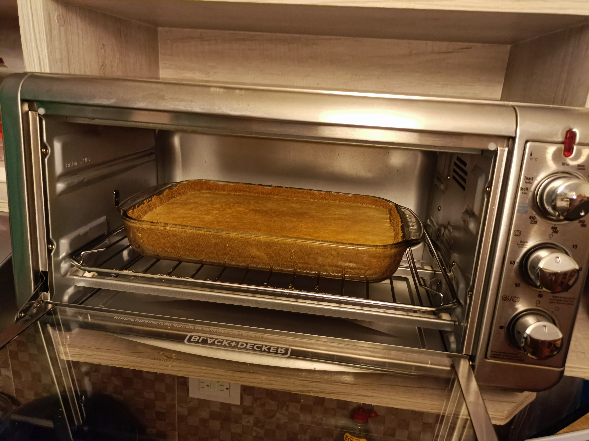

https://www.youtube.com/watch?v=dOh65zFSyQc

# Cantidades:

- 2 Rollos de galletas marias (333.3 g)
- 2 Barritas de mantequilla (180 g)
- 1 Barra de queso crema (philadelphia) (190 g)
- 4 Huevos
- 1 Lata de leche evaporada (339.9 ml)
- 1 Lata de leche condensada (284.1 ml)
- 2 cdas vainilla

# Receta:

- Precalentar el horno a 200 °C (no se requiere con un buen horno)
- Hacer pasta las galletas en licuadora
- Amasar con mantequilla en el molde hasta tener una masita
- Extender en 2 moldes pequeños o 1 grande
- En la licuadora por 30 sec: queso crema, huevos, leches y vainilla
- Vertir en los moldes
- Hornear a 180 °C por 45 min
```shell
- Con horno electrico
Hornear por 65 minutos
```


